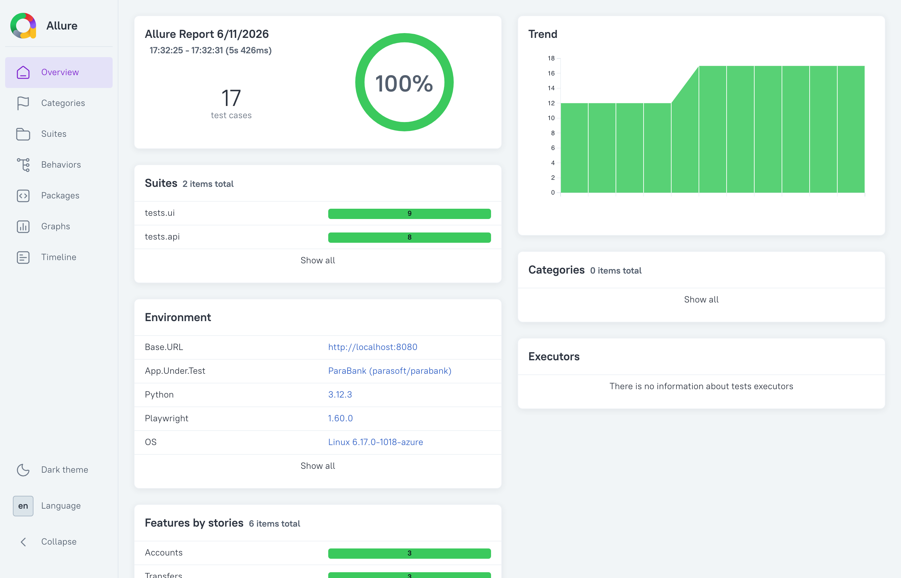
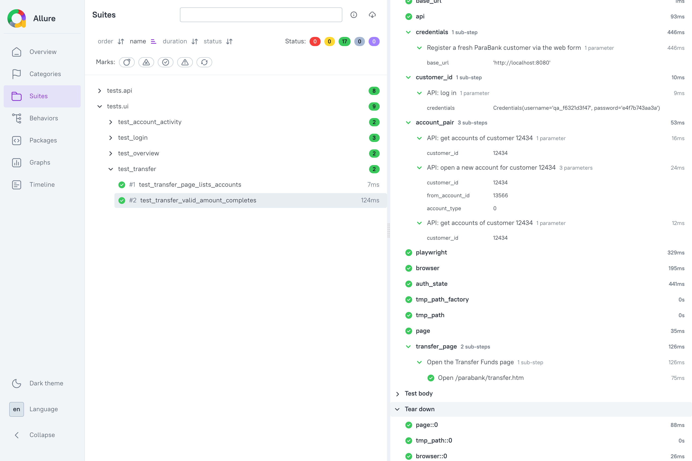
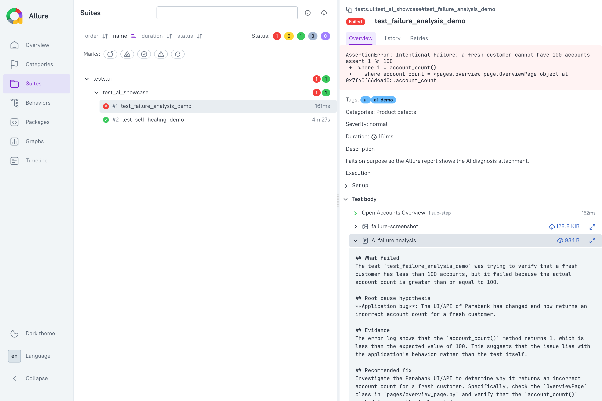

# ParaBank QA — AI-Assisted Test Automation

[](https://github.com/coldvalsidalv/qa-automation-parabank/actions/workflows/ci.yml)
[](https://github.com/coldvalsidalv/qa-automation-parabank/actions/workflows/ci-dotnet.yml)
[](https://github.com/coldvalsidalv/qa-automation-parabank/actions/workflows/codeql.yml)

[Live Allure report](https://coldvalsidalv.github.io/qa-automation-parabank/) · [AI demo report](https://coldvalsidalv.github.io/qa-automation-parabank/ai-demo/) · [.NET report](https://coldvalsidalv.github.io/qa-automation-parabank/dotnet/)

Test automation for [ParaBank](https://parabank.parasoft.com) — a demo banking
application with a full UI and REST API — built to show two things: **AI is a
force multiplier for a QA engineer, not a replacement**, and the approach is not
tied to one language.

## Run it yourself

Everything runs in Docker — no Python, no .NET, no browser install. One command
brings up the application under test and runs the suite against it:

```bash
git clone https://github.com/coldvalsidalv/qa-automation-parabank.git
cd qa-automation-parabank

# critical path (63 tests)
docker compose run --rm --build --user "$(id -u):$(id -g)" tests

# everything (164 tests)
docker compose run --rm --build --user "$(id -u):$(id -g)" tests pytest
```

The first run builds the test image and pulls ParaBank, which takes a few
minutes; after that a full run is about ten seconds.

Two details in that command are not decoration. `--build` matters on a repeat
run: Compose reuses a cached image otherwise, and you would be testing
yesterday's code. `--user` matters on Linux: the container writes the Allure
results into your clone through a bind mount, and as root it would leave files
there that need `sudo` to delete and that break a later local `pytest` run.

Expect one skip: the test that compares the `ruff` pin in `.pre-commit-config.yaml`
against `uv.lock` cannot run inside the image, because that file lives at the
repository root, outside the image's `./python` build context. It says so when it
skips.

To work on the suite rather than just run it, see the
[Python quick start](python/README.md#quick-start) — `uv sync`, `playwright
install chromium`, `pytest`.

[](https://codespaces.new/coldvalsidalv/qa-automation-parabank?quickstart=1)

The Codespaces button gives you a cloud machine with Docker ready; run the same
commands there.

## Two stacks, one test plan

The same patterns — page objects, self-provisioned test data, business-level
Allure steps, retain-on-failure artifacts, AI failure triage — implemented on
two stacks. The [test plan](docs/test_plan.md) covers both, with a section per
stack — though the defect register applies to the Python suite only: the C#
slice deliberately covers happy paths and documents no defects, which the plan
states explicitly rather than leaving to inference.

| | Stack | Scope | Where |
|---|-------|-------|-------|
| **Python** (primary) | pytest · Playwright · httpx · Allure | Full suite — 164 tests: 88 API (13 resource areas + JSON-Schema contract checks) + 37 UI + 39 unit (AI module and repository invariants, no app required); 24 defects as 36 strict-xfail; +2 opt-in AI-showcase | [python/](python/README.md) |
| **C# / .NET** (slice) | NUnit · Playwright for .NET · Allure.NUnit | Vertical slice — auth + accounts + transfer, UI + API, 15 tests (+1 AI-showcase), AI failure hook | [dotnet/](dotnet/README.md) |

The C# slice exists to prove portability, not to maintain two copies of
everything — hence a focused slice rather than full parity.

## What the report looks like

The [live Allure report](https://coldvalsidalv.github.io/qa-automation-parabank/)
(Python suite) is published from CI on every run.

Overview — pass rate, trend, the Environment widget, and features-by-story:



Each test reads like a classic test case: business-level steps with the
underlying actions nested, including the fixtures that register a customer and
open accounts via the API:



A failed test carries its evidence — screenshot, Playwright trace, video, and
the AI diagnosis (root cause, evidence, recommended fix) generated by a local
model:



## Defects found in the application under test

Probing the app while writing assertions surfaced 24 real ParaBank defects,
documented as `xfail(strict=True)` so the suites alert if they ever get fixed
([full list](docs/test_plan.md#defects-found-in-the-application-under-test)).
Highlights:

- **Critical: the REST API has no authentication (D-09).** An unauthenticated
  caller can read any customer's PII and withdraw their money just by putting a
  (sequential, guessable) account id in the URL —
  [`test_security_api.py`](python/tests/api/test_security_api.py) demonstrates
  the theft end to end.
- **Critical: money creation (D-12, D-13).** `buyPosition` accepts a negative
  share count and credits the account instead of debiting it; `sellPosition`
  sells shares the customer does not own, with no ownership check at all. A
  single call is bounded only by `Integer.MAX_VALUE`, and nothing stops
  repeating it.
- **Critical: the admin page has no authentication (D-18)** — including the
  control that wipes the entire database.
- Negative-amount transfers and withdrawals are accepted — a money pump that
  drains accounts (zero-amount and same-account transfers pass too).
- No overdraft protection: withdrawals exceeding the balance succeed.
- Bill pay returns HTTP 500 whenever the payee payload carries a
  `routingNumber` key at all — any value, even `""` — while omitting the field
  succeeds (D-08); it also accepts a negative amount and credits the payer (D-21).
- A protected page answers an unauthenticated request with HTTP 500 and an
  internal-error page instead of redirecting to the login form (D-22).
- `updateCustomer` always returns HTTP 500 — the profile cannot be changed via API (D-10).
- `getPositionHistory` returns 400 for every valid position — the history endpoint is inaccessible (D-11).

## CI/CD

All workflows run ParaBank as a service container — no dependency on the public
demo, no secrets:

- **[ci.yml](.github/workflows/ci.yml)** — Python lint + type-check (mypy) +
  smoke on PRs; the full suite on push to `main` and a weekly schedule; any
  marker on demand (`workflow_dispatch`); Allure report with history published
  to GitHub Pages.
- **[ci-dotnet.yml](.github/workflows/ci-dotnet.yml)** — the .NET slice on push/PR
  touching `dotnet/`, and on demand.
- **[ai-demo.yml](.github/workflows/ai-demo.yml)** — manual AI showcase: installs
  Ollama on the runner and publishes a report with real AI attachments to `/ai-demo`.
- **[codeql.yml](.github/workflows/codeql.yml)** — static analysis of Python and C#.

`main` is protected (required checks, up-to-date branches, no force-push).
Dependabot keeps dependencies and Actions current; `ruff` and `mypy` run as
pre-commit hooks and CI gates.

## License

[MIT](LICENSE) © 2026 Uladzislau. Free to read, fork, and learn from — keep the
copyright notice. Built as a portfolio piece; the ParaBank application under
test is a separate product of Parasoft.

## Repository layout

```
├── python/        # Python suite (pytest + Playwright) — see python/README.md
├── dotnet/        # C#/.NET vertical slice (NUnit) — see dotnet/README.md
├── docs/          # shared test plan, defect register, discovery notes, report images
├── docker-compose.yml  # ParaBank app under test (+ optional Ollama)
└── .github/workflows/  # CI, AI demo, CodeQL
```
